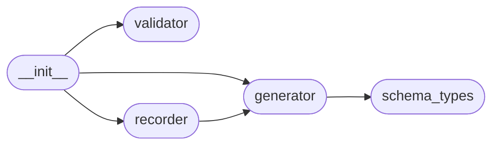

# Code Overview

[_Documentation generated by Documatic_](https://www.documatic.com)

<!---Documatic-section-Codebase Structure Python-start--->
## Codebase Structure Python

The codebase has a flat structure, with 5 code files.

<!---Documatic-block-system_architecture-start--->

<!---Documatic-block-system_architecture-end--->

# #
<!---Documatic-section-Codebase Structure Python-end--->

<!---Documatic-section-Key Objects-start--->
## Key Objects

There are exposed imports at level-0
from the source directory (json_schema_generator)

<!---Documatic-block-json_schema_generator-start--->

	
<code>json_schema_generator</code> (Click to Expand!)

* `json_schema_generator.generator.SchemaGenerator`
* `json_schema_generator.generator.json_path`
* `json_schema_generator.recorder.Recorder`
* `json_schema_generator.validator.Validator`

<!---Documatic-block-json_schema_generator-end--->

# #
<!---Documatic-section-Key Objects-end--->

<!---Documatic-section-Important Functions-start--->
## Important Functions

<!---Documatic-block-important_funcs-start--->
<!---Documatic-block-most_used_funcs-start--->
### Most Utilised Functions

* json_schema_generator.generator.json_path (1 times)
<!---Documatic-block-most_used_funcs-end--->

<!---Documatic-block-end_user_funcs-start--->
### End User Exposed Functions

* json_schema_generator.recorder.Recorder
* json_schema_generator.validator.Validator
* json_schema_generator.generator.SchemaGenerator
* json_schema_generator.generator.json_path
<!---Documatic-block-end_user_funcs-end--->
<!---Documatic-block-important_funcs-end--->

# #
<!---Documatic-section-Important Functions-end--->

<!---Documatic-section-File IO-start--->
## File IO

<!---Documatic-block-file_io-start--->
The following files have file read operations

<!---Documatic-block-json_schema_generator-start--->

	
<code>json_schema_generator</code> (Click to Expand!)

* json_schema_generator.recorder
* json_schema_generator.validator

<!---Documatic-block-json_schema_generator-end--->

The following files have file write operations

<!---Documatic-block-json_schema_generator-start--->

	
<code>json_schema_generator</code> (Click to Expand!)

* json_schema_generator.recorder

<!---Documatic-block-json_schema_generator-end--->
<!---Documatic-block-file_io-end--->

# #
<!---Documatic-section-File IO-end--->

<!---Documatic-section-Class Hierarchy-start--->
## Class Hierarchy

<!---Documatic-block-Exception-start--->

	
<code>Exception</code> (Click to Expand!)

* json_schema_generator.schema_types.JsonSchemaTypeNotFound

<!---Documatic-block-Exception-end--->

<!---Documatic-block-object-start--->

	
<code>object</code> (Click to Expand!)

* json_schema_generator.generator.SchemaGenerator
* json_schema_generator.schema_types.ArrayType
* json_schema_generator.schema_types.BooleanType
* json_schema_generator.schema_types.NullType
* json_schema_generator.schema_types.NumberType
* json_schema_generator.schema_types.ObjectType
* json_schema_generator.schema_types.StringType
* json_schema_generator.schema_types.Type
* json_schema_generator.validator.Validator

<!---Documatic-block-object-end--->

# #
<!---Documatic-section-Class Hierarchy-end--->

[_Documentation generated by Documatic_](https://www.documatic.com)