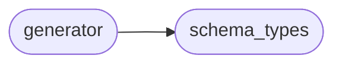

# Json Schema Generator Generator

[_Documentation generated by Documatic_](https://www.documatic.com)

<!---Documatic-section-Codebase Structure-start--->
## Codebase Structure

<!---Documatic-block-system_architecture-start--->

<!---Documatic-block-system_architecture-end--->

# #
<!---Documatic-section-Codebase Structure-end--->

<!---Documatic-section-json_schema_generator.generator.json_path-start--->
## json_schema_generator.generator.json_path

<!---Documatic-section-json_path-start--->
<!---Documatic-block-json_schema_generator.generator.json_path-start--->
<details>
	<summary><code>json_schema_generator.generator.json_path</code> code snippet</summary>

```python
def json_path(obj, *args):
    if not obj:
        return None
    for arg in args:
        if arg not in obj:
            return None
        obj = obj[arg]
    return obj
```
</details>
<!---Documatic-block-json_schema_generator.generator.json_path-end--->
<!---Documatic-section-json_path-end--->

# #
<!---Documatic-section-json_schema_generator.generator.json_path-end--->

[_Documentation generated by Documatic_](https://www.documatic.com)